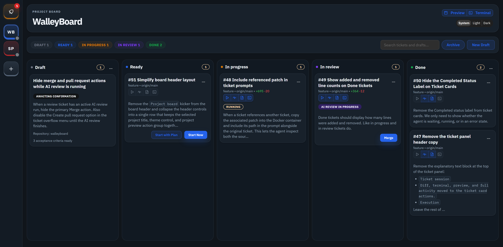

# WalleyBoard

> [!WARNING]
> Run it at your own peril.

Pronounced `/ˈwɑːli bɔːrd/`.

WalleyBoard is a vibe-coded, local-first workbench for handing the fiddly stuff to a tireless little helper while you stay planted in your chair and run the show from the board. This repo contains the current MVP plus the starter product documentation in [ai_walleyboard_prd.md](./ai_walleyboard_prd.md).

Runtime state lives under `~/.walleyboard/`, with `walleyboard.sqlite` as the source of truth for drafts, tickets, sessions, and review metadata so the repo checkout stays focused on code instead of accumulating local app data.

## Screenshot

## Workspace Layout

- `apps/backend`: local Fastify backend, WebSocket transport, route scaffolding, and execution service boundaries
- `apps/web`: React + Mantine frontend shell for the WalleyBoard UI
- `packages/contracts`: shared Zod schemas and protocol contracts used by backend and frontend
- `packages/db`: reference Drizzle schema for the local SQLite model; the runtime source of truth lives in `apps/backend/src/lib/sqlite-store`
- `docs`: implementation notes that turn the PRD into module-level build guidance

## Current Structure

- `apps/backend/src/lib/sqlite-store`: SQLite bootstrap helpers plus focused repositories and workflow services for projects, drafts, tickets, sessions, events, and review artifacts
- `apps/backend/src/lib/execution-runtime`: the `ExecutionRuntime` facade plus focused helpers for prompts, CLI args, validation, event publishing, and process/session coordination
- `apps/backend/src/routes/tickets`: ticket route registration split by concern so read/workspace, execution, lifecycle, and review flows stay isolated
- `apps/web/src/features/walleyboard`: single-screen UI composition, feature-scoped controllers, websocket cache syncing, and extracted board, inspector, and modal modules

## Current Status

Implemented now:

- local Fastify + React app with shared contracts, SQLite persistence, and websocket-driven board/session updates
- board workflow with `Draft`, `Ready`, `In progress`, `In review`, and `Done`
- project options for host or Docker-backed execution, model overrides, and pre/post-worktree commands
- draft workflow with persisted Markdown drafts plus `Refine`, `Questions`, `Revert Refine`, and `Create Ready`
- artifact-backed Markdown image references for pasted screenshots, preserved by stable `artifact_scope_id` values across save, reload, refine, revert, and draft-to-ready promotion
- execution workflow that starts a `ready` ticket into a persisted session, prepares a git worktree, supports immediate execution or a planning-first start, runs real `codex exec`, and keeps follow-up attempts on the same logical session and worktree
- Codex-managed execution modes through `codex exec`, with planning-first runs using read-only behavior and implementation runs using workspace-write behavior
- review workflow that runs configured validation commands, generates a local review package and diff artifact, supports request changes and resume, exposes card-level diff/terminal/preview/activity actions plus an inspector activity summary row, and merges directly from `review` into the target branch with cleanup
- ticket lifecycle controls for archive/restore plus interrupted-session restart from scratch
- conservative restart recovery that marks active sessions `interrupted` instead of auto-restoring live execution

Not yet implemented:

- automatic restoration of a live execution after an application restart
- GitHub pull request creation or external review reconciliation from the `review` stage
- richer validation configuration and review-time override handling beyond the current project setup defaults

## Current Workflow Terms

- Board columns and ticket states use `Draft`/`draft`, `Ready`/`ready`, `In progress`/`in_progress`, `In review`/`review`, and `Done`/`done`
- The draft-to-ready flow is `edit draft -> Refine or Questions -> optional Revert Refine -> Create Ready`
- Execution sessions use `queued`, `running`, `paused_checkpoint`, `paused_user_control`, `awaiting_input`, `interrupted`, `failed`, and `completed`
- The review flow is `ready -> in_progress -> review -> done`, with request changes or resume moving work back into `in_progress` on the same logical session and worktree
- Ticket cards with prepared worktrees expose a compact action group for `Diff`, `Terminal`, `Preview`, and `Activity`; the inspector keeps a single activity summary row that opens the same interpreted stream
- The `Preview` action starts the ticket dev server when needed, opens a browser tab, and switches to a stop control while that dev server is running
- Completed tickets can be archived out of the active board and restored later
- Interrupted in-progress work can either resume on the preserved worktree or restart from scratch after cleanup

## Required Command Line Tools

Install these on the host machine before starting WalleyBoard:

- `node` 22 or newer, with the bundled `npm`
- `bash`
- `git`
- `codex`

WalleyBoard uses `git` to verify repositories, create worktrees, diff changes, and merge reviewed work. The default agent integration runs the real `codex` CLI for draft refinement and ticket execution, so the backend expects `codex` to be installed and already authenticated in your normal shell environment.

## Optional Command Line Tools

- `docker`: only needed if you want a project to run ticket work inside a managed container instead of on the host
- `claude`: only needed if you want to use the Claude Code adapter instead of Codex

If you want Claude Code support, create `~/.walleyboard/claude-cli-path` and put the absolute path to your `claude` binary in that file. WalleyBoard uses that exact path for both health checks and runtime execution.

## Quick Start

1. Install the required command line tools listed above.
2. Install dependencies with `npm install`.
3. Start the backend with `npm run dev:backend`.
4. Start the frontend with `npm run dev:web`.
5. Open the Vite URL shown in the frontend terminal, usually `http://127.0.0.1:5173`.
6. Generate database artifacts later with `npm run db:generate`.

## Optional Docker Support

Docker is optional. The app itself runs directly on your host machine; Docker only affects ticket execution for projects configured with the `Docker` execution backend.

To use Docker-backed execution:

1. Install Docker Desktop or Docker Engine.
2. Make sure the Docker daemon is running and `docker version` succeeds in your shell.
3. Start WalleyBoard normally with `npm run dev:backend` and `npm run dev:web`.
4. In project settings, choose the `Docker` execution backend for a Codex-backed project.

On the first Docker-backed run, WalleyBoard builds the runtime image from [`apps/backend/docker/codex-runtime.Dockerfile`](./apps/backend/docker/codex-runtime.Dockerfile). That image installs Node, Git, ripgrep, and the Codex CLI, then mounts the ticket worktree at `/workspace` and your host `~/.codex` directory into the container so Codex can reuse your existing configuration.

`Claude Code` does not currently support the Docker execution backend in WalleyBoard, so Docker projects should use the `Codex` adapter.

## Quality Gates

- `npm run sizecheck`: fails if any production source file under `apps/**/src` or `packages/**/src` exceeds 1500 lines
- `npm run lint`: runs `sizecheck` first, then workspace Biome checks
- `npm run typecheck`: runs TypeScript checks across all workspaces
- `npm run test`: runs the backend and web `node:test` suites from the repo root

## Draft Markdown And Screenshots

- Draft descriptions and acceptance criteria are authored as Markdown, stored in SQLite text fields, and previewed before refinement or promotion
- Ready-ticket Markdown stays in SQLite-backed ticket records too; WalleyBoard does not create standalone ticket Markdown files on disk
- Pasting a screenshot into the draft description stores the image under the backend's walleyboard-managed artifact path and inserts an artifact-backed Markdown image reference into the draft
- The image reference stays attached to the same draft through save, reload, refine, revert, and promote-to-ready flows because drafts and ready tickets share a stable `artifact_scope_id`

## Next Milestones

- Add GitHub pull request creation and reconciliation when direct merge is not the right review path
- Add richer validation configuration and override handling
- Decide whether interrupted sessions should auto-resume or stay manual after restart

## License

The repository source code is available under the [MIT License](./LICENSE).

`apps/web/public/alert.mp3` is a third-party audio asset, sourced from Pixabay,
credited to `Universfield`, and excluded from the repository MIT license. See
[THIRD_PARTY_NOTICES.md](./THIRD_PARTY_NOTICES.md) and
`apps/web/public/alert.mp3.license.txt`.
